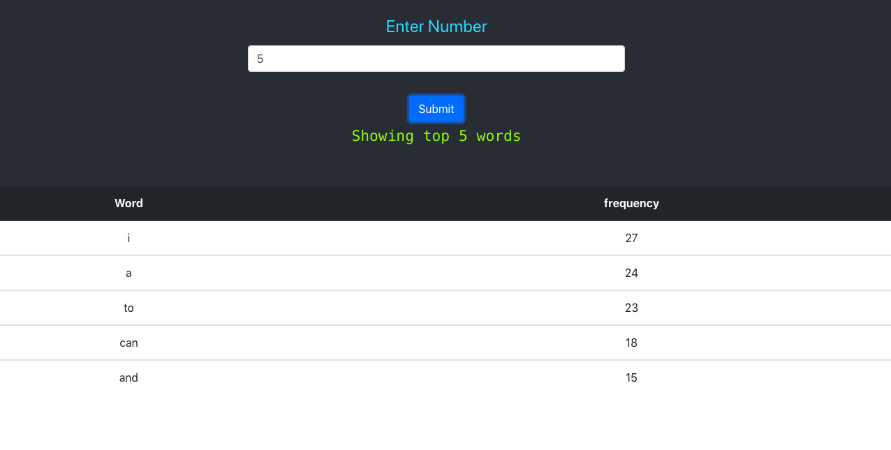
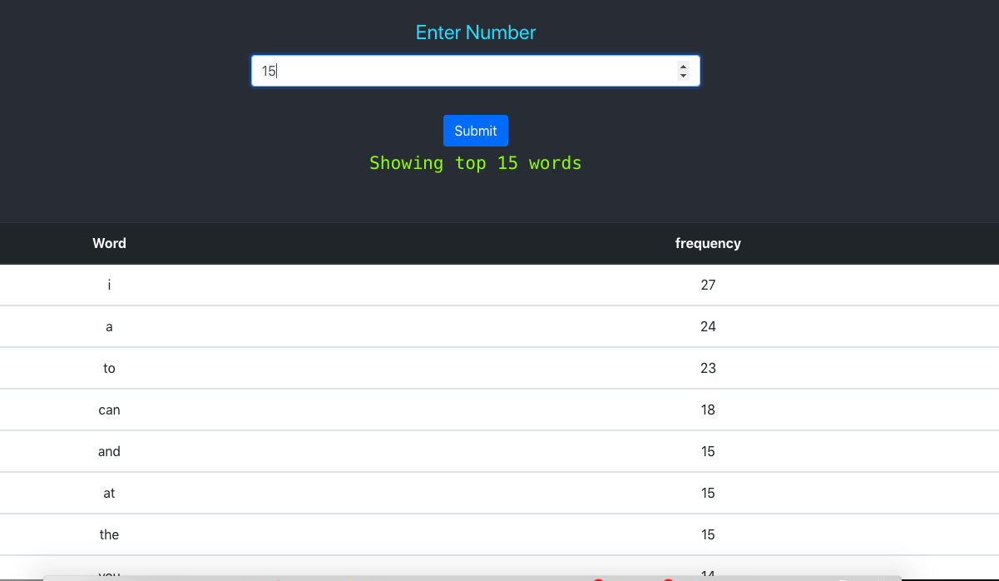
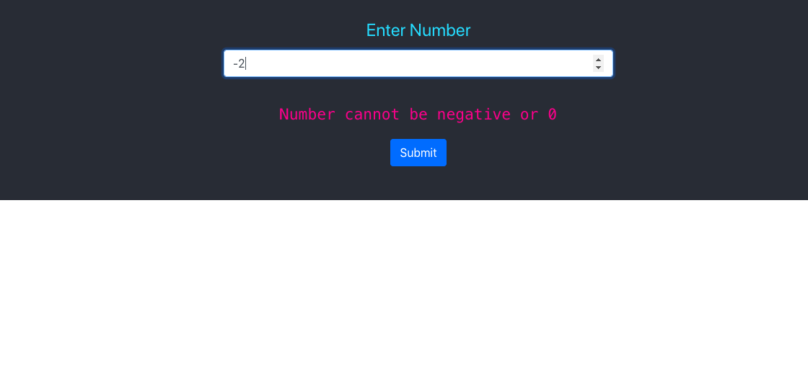

# Word Counter

This project includes two directories one for Backend Nodejs and the other for frontend react.

# Installation Instruction

Nodejs version >10 and NPM version >6 is required.
  - Install dependencies with npm install on both the projects.
  - First run the Backend server with npm start.
  - By default the server starts at port 5000.
  - Once the Server is running start React app with npm start.

# React Components

Two components are used in React project-
  1. App.js
  - This component is responsible for fetching data from backend.
  - Also all the other error handling is done in this component.
  - All the states are managed in this component.
 2. Word.js
 - Responsible for renderring the result in the table.
# Backend

  - Data is fetched from the given file url using node-fetch.
  - Certain functions like toLowerCase(), replace(), split() are used to clean the string.
  - The string is then converted to array of word.
  - Array is then converted to an object with key value pair where key is the word and value is it's frequency.
 2. Word.js
 - Responsible for renderring the result in the table.

# Dependencies
1. Nodejs-
    express: 4.17.1
    node-fetch: 2.6.0
- No External Libraries and pakages used in react project.

# Here is a screenshot of running application

Heroku Link: https://secure-anchorage-13445.herokuapp.com/
